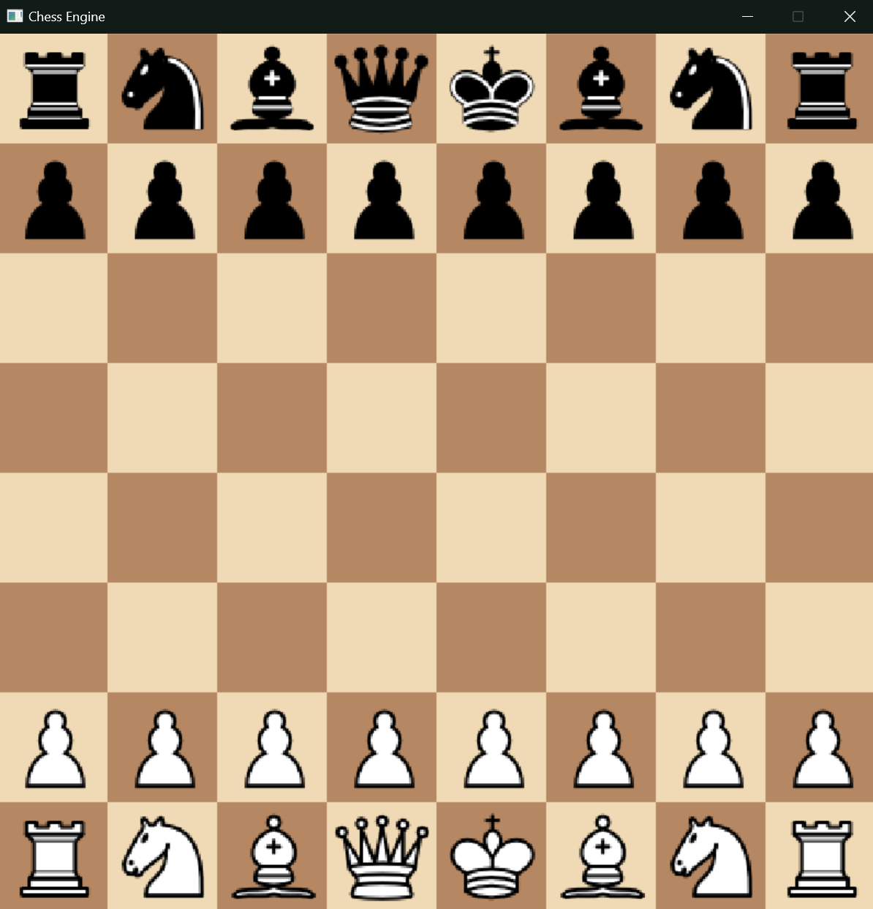
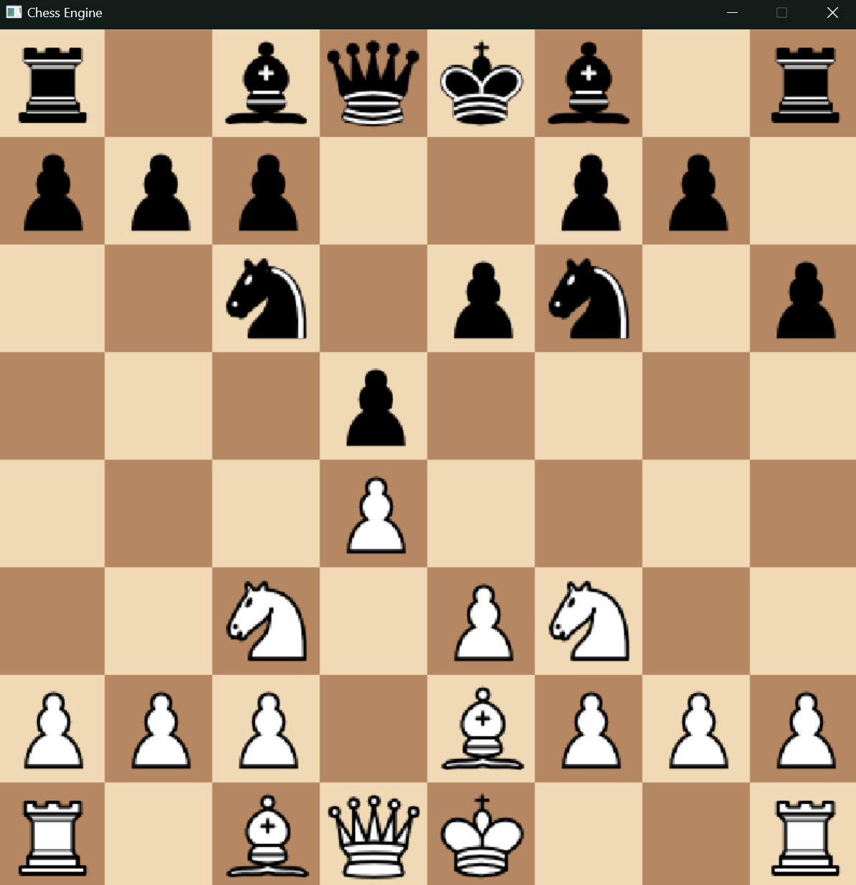

    
    <h1>Chess Engine ♔</h1>
    
    
    

## Table of Contents

1. [Overview](#-overview)
2. [Features and Demo](#features-and-demo)
3. [License](#-license)

## 🌟 Overview

**Chess Engine** is a C++ based application designed to simulate a chess environment where users can play against another player. The game utilizes the Simple Directmedia Layer framework to render the chess board and pieces. This project heavily involved Object Oriented Programming to control the game state, each piece's movement mechanics at any given position, and turn taking.

This project is a combination of my passion for Software Development and Chess. I have enjoyed both playing chess and programming ever since I first picked them up, and I find it fascinating how each of them offer their own unique complexities and abstractions. I was inspired by [Gotham Chess](https://youtube.com/gothamchess) to create this application. My future plan for this passion project is to add algorithms that can evaluate the board state and make moves of their own.

## **Features and Demo**

### Feature 1: Graphical User Interface

- **Description**: The chessboard and pieces are graphically rendered using SDL, providing a visually appealing interface for players.

  - **Screenshot**:

    

### Feature 2: Piece Movement and Rules

- **Description**: Each piece's movement logic follows standard chess movement rules. For example, the Bishop can only move diagonally, while the King can move one square in any direction.

  - **Screenshot**:

    

## 📄 License

This project is licensed under the MIT License - see [LICENSE.md](LICENSE.md) for details.
